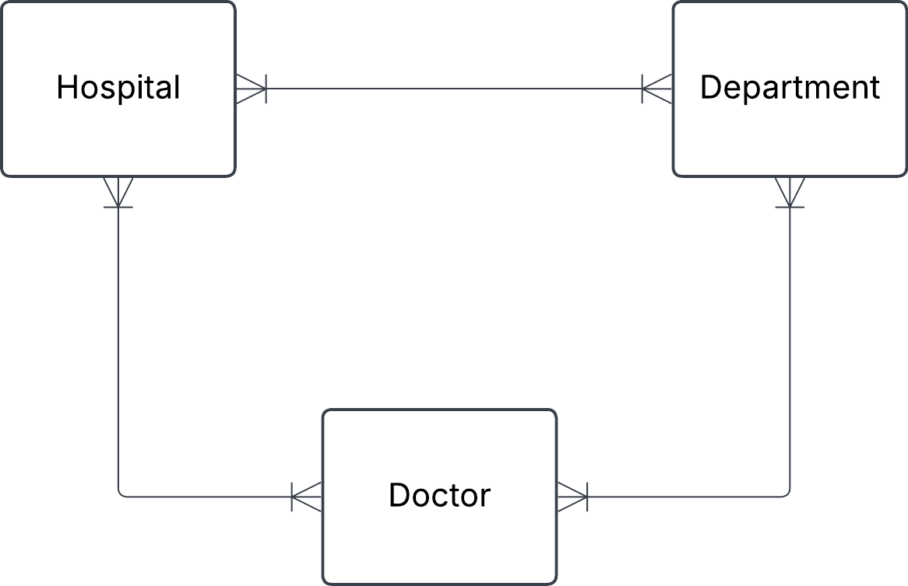
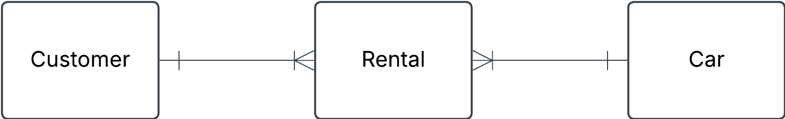
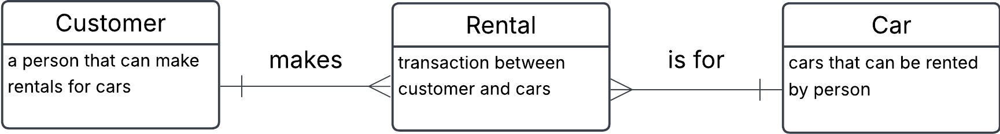

You have this json data, convert it into three tables: Hospital, Department and Doctor. Fill these tables with data. Do this manually and not programmatically.

{
"hospital": "Sjukhusstock",
"address": "Drottninggatan 3, Stockholm",
"departments": [
{
"name": "Kardiologi",
"doctors": [
{ "id": 1, "name": "Dr. Abra Abrahamson" },
{ "id": 2, "name": "Dr. Erika Eriksson" }
]
},
{
"name": "Neurologi",
"doctors": [{ "id": 3, "name": "Dr. Sven Svensson" }]
}
]
}

Approach

- identify entities
- identify relationships and cardinalities
- create conceptual ERD
- create tables

**Initial naive conceptual ERD**

**Inital tables**

Hospital

| Hospital_id | name         | address          |
| ----------- | ------------ | ---------------- |
| 1           | sjukhusstock | Drottninggatan 3 |

Department

| Hospital_id | name       |
| ----------- | ---------- |
| 1           | kardiologi |
| 2           | neurologi  |

Department

| Hospital_id | name                |
| ----------- | ------------------- |
| 1           | Dr. abra abrahamson |
| 2           | Dr. Erik Eriksson   |
| 3           | Dr. Sven Sevensson  |

Refined with bridge tables to reflect many-to-many relationships

HospitalDepartment

| Hospital_department_id | hospital_id | department_id |
| ---------------------- | ----------- | ------------- |
| 1                      | 1           | 1             |
| 2                      | 1           | 2             |

--
Entities:

**- Book**
-ISBN
-Name
-title
-author

<[NOTE]> ISBN is a unique number for a book, which could be used as a 'primary key', this will make it into a 'natural key'

**- Member**
-membership_id
-first_name
-last_name
-phone
-address
-email

**Borrowing**
- borrowing_id
- ISBN
- membership_id
- return_date
- borrow_date 

- A Member can have zero, one or several borrowings 
- A Borrowing can be made by one and only/ one member
- A Borrowing is linked to one and only one Book
- A Book can be in zero, one or more borrowings

Initial conceptual ERD

 
Replaced many-to-many with bridge table (composite entity)

## Car rental

 

 - Customer is a person that can make rentals for cars 

 - Car is the cars that can be rented by person 

 - Rental (Composite entity) is transaction between customer and cars 

  b) see image above
  
  c)

 - customer to rental (one-to-many) 
 - Rental to customer (many-to-one)
 - Rental to car (many-to-one)
 - Car to Rental (many-to-many)
  

    d)
  - Each Customer makes one or more Rentals over time 
  - Each Rental is connected to one customer
  - Each Rental is for one car 
  - Each Car can be in several Rentals

